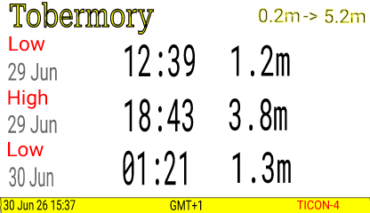

# eInk Labels for SignalK

** BETA - basic functionality, limited vendor/product support **

A SignalK plugin to display data from SignalK paths, APIs and plugins on Electronic Shelf Labels over a Bluetooth Low Energy (BLE) connection.  

Electronic Shelf Labels (ESLs) are [eInk](https://en.wikipedia.org/wiki/E_Ink) devices that consume very little battery energy, presuming they are not constantly updated - the battery is used only when the display changes, and a periodic BLE check for incoming changes. Perfect for info that changes only once or twice a day, like tidal information.

Since they are designed to be used in large quantity in small shops, they are cheap and simple devices. Earlier models required dedicated controllers, or updates over Wifi or NFC, whereas many modern ones are standalone BLE devices that can be updated from a phone or server.

Unlike some eInk projects, this plugin doesn't require any physical modification to the labels, or loading any new firmware. It can send an image to a supported shelf label fresh out of the box.

## Examples

### Tide Clock

The tide clock needs the [signalk-tides](https://github.com/openwatersio/signalk-tides) plugin to be installed and publishing tides to the Resources API. It can however be customized to run with other APIs or take data only from SignalK data paths.

## Templating

Templates are simply SVG files, to which expressions can be added to use SignalK data, with options to make it easier to read, like rounding or simplifying dates and times. The template can have sample data in the placeholder, so is easy to layout and visualize.

### Template Source Specification

In the `description` of the SVG text box, use a comma separated set of key value pairs to define the data source and formatting.

#### SignalK Paths

For example, `path=environment.forecast.description` uses the default data source (the `self` vessel context) and the named SignalK path. A bare path with no key/value pairs at all, e.g. just `environment.forecast.description`, is shorthand for the same thing. Overriding the default context can be done with `path=environment.forecast.description,context=vessels.urn:mrn:imo:mmsi:232345678` - the `context` value must match a real SignalK context exactly as it appears in the Data Browser.

#### SignalK REST APIs

The source can be overridden to use the SignalK server's Resources API instead. For example, `source=resources,resource=tides,path=station.name` picks the `tides` resource and pulls the `station.name` path out of the JSON response - this works for any resource type (`tides`, `waypoints`, `routes`, ...), and needs nothing configured: the plugin reaches the Resources API directly. Where a resource is specified, it will be fetched once for that render, and subsequent fields sourced from the same resource use that cached response.

#### Plugin Data

`source=einklabel` reads data injected by the plugin itself, rather than from SignalK. Currently the only such value is `path=repainted`, the timestamp of the current repaint - for example `source=einklabel,path=repainted,format=local_datetime_short` to show when the label was last updated.

#### Customizing Output

A `format` can be specified to make the value easier to understand. The supported formats are:

* `local_time` - reduce a time stamp to just the time (H:M:S), omitting the date, and applying daylight savings if appropriate
* `day_mon` - reduce a time stamp to day and month, e.g. `27 Jun`, applying daylight savings if appropriate
* `local_datetime_short` - format a time stamp as day, abbreviated month, 2-digit year and 24h time, e.g. `21 Jun 26 18:05`, applying daylight savings if appropriate
* `utc_offset` - Show a timezone in `UTC+01:00` style format
* `position` - Format a `{ latitude, longitude }` value as decimal degrees with hemisphere letters, e.g. `56.6250°N 6.0700°W`
* `raw` - Don't apply automatic SignalK unit conversion and symbol display (see below)

SignalK's unit preferences are used to automatically convert a `signalk`-sourced numeric value to its preferred display unit, and append a unit symbol like `kt` or `m`, unless `format=raw` is specified to switch that off. However, when using plugin or API data there may be no path metadata to convert from (for example `signalk-tides` publishes tide data to the Resources API, and `level` is a raw metre value with no SignalK path of its own) - in these cases an explicit `category` can be given instead, and the unit preferences will be applied the same way, for example `category=depth` for the tides level figure.

Note that for dates and times, the server timezone must be set correctly, for example `Europe/London` rather than the default `Etc/UTC`. This can be done on Linux using `timedatectl` or `raspi-config` if using a Raspberry Pi with Raspian.

Common categories:

* `depth` - Use the SignalK preferred depth unit, make the conversion if needed, and tack on the unit name as a suffix
* `speed` - Use the SignalK preferred speed unit, make the conversion if needed, and tack on the unit name as a suffix
* `temperature` - Use the SignalK preferred temperature unit, make the conversion if needed, and tack on the unit name as a suffix

Additionally, `round=n` can be used to round to limited decimal places.

These can all be combined as in `source=resources,resource=tides,path=extremes[2].level,category=depth,round=2`

### Fonts

Three font types are loaded by default, use the font name or simply 'sans-serif' in the SVG editor and choose size and weight (bold, semi-bold etc). Some labels will make a decent attempt to gray scale. Use the simple pure red, yellow, white, black to match the label's limited colour choice (some labels only offer black and white, or black/white/red).

* `serif` - Playfair Display
* `sans-serif` - Roboto
* `monospace` - JetBrains Mono

## Command Line Interface

To get fast feedback on templates and shelf devices without updating and configuring SignalK, a CLI is provided that has these commands.

- `vendors` - list supported vendors
- `scan` - report supported devices found from a BLE scan

See also the commands useful for debugging under [Developing Templates]
- `render` - transform an SVG template and data into a PNG
- `paint` - render an SVG template and data to a selected ESL

## Vendors

### Zhsunyco

Also known as 'Suny'

- [BLE ESLs](https://www.zhsunyco.com/digital-display-solution-for-small-retail-business/ble-esl-solution/)
  - The range of labels available on retail sites like AliExpress may be larger than on their corporate site
  - In mid 2026, a 4 colour (BWRY) 3.7" label retailed for about $35, with quantity discounts for bulk sets
  - Cheapest units are 2 colour 1.54", and they go up to 7.5"

Python code for a variety of their labels at https://github.com/roxburghm/zhsunyco-esl and https://github.com/NickWaterton/Wolink

## Architecture

The primary things managed and provided by the plugin are:

* ESL Vendor
* ESL Device
* SVG Template
* SignalK API base URL
  - Used for automatic unit conversion on `signalk`-sourced numeric values and for resolving an explicit `category=` binding - neither has an in-process equivalent, both go via this server's own REST API
  - Optional: left blank, the plugin probes the probable values in likelihood order at startup - `http://localhost:3000`, `http://localhost`, `https://localhost`. Set it explicitly to skip probing
  - Either way, errors clearly if nothing responds (wrong port) or the probe is rejected (anonymous read access not enabled) - these endpoints must allow anonymous read access, since the plugin has no login flow

### Extending

#### Hardware

Additional vendors and devices can be added by a separate npm package that implements the `VendorDriver` interface and registers itself - there's no scanning of installed packages, registration is always an explicit call by the extension's own code.

- `import esl from '@rhizomatics/signalk-einklabel-plugin'; esl.registerVendorDriver(myDriver)`
- In the SignalK runtime, call this from the extension's own plugin `start()`. In the CLI, load the extension with `esl-cli --require <module> <command>`.
- Declare this package as a `peerDependency` (not a regular dependency) in the extension package, so npm resolves a single shared copy of the registry.

#### Developing Templates

Templates can be added to the configurable directory. [Inkscape](https://inkscape.org) free, open source, and recommended for editing templates, or your own favourite editor, or by hand in a text editor for hard core (or just tidying up the template side).

Inkscape adds its own metadata to images, which can be stripped off by exporting a simple SVG, although can be left in place with no harm; main reason to simplify the SVG is manual changes in a text editor.

The `esl-cli` can be used to debug and validate templates quickly:

* `render` - Render templates with SignalK data and write to a local PNG file
* `paint` - Render templates with SignalK data and send to selected ESL device
* `fields` - List the fields in the template, with the source specification and the rendered data value
* `field` - Accept a source specification (outside of any template context) and return the rendered value if available
